## Remote Assist Design Docs

### Project Summary:

Frontdesk is a proposed AI assistant that handles routine patient enquiries for Australian clinics via phone and website chat, referring clinical matters to staff. It is a concept, not a working service. The application’s design documents are displayed below.

### Website Widget:

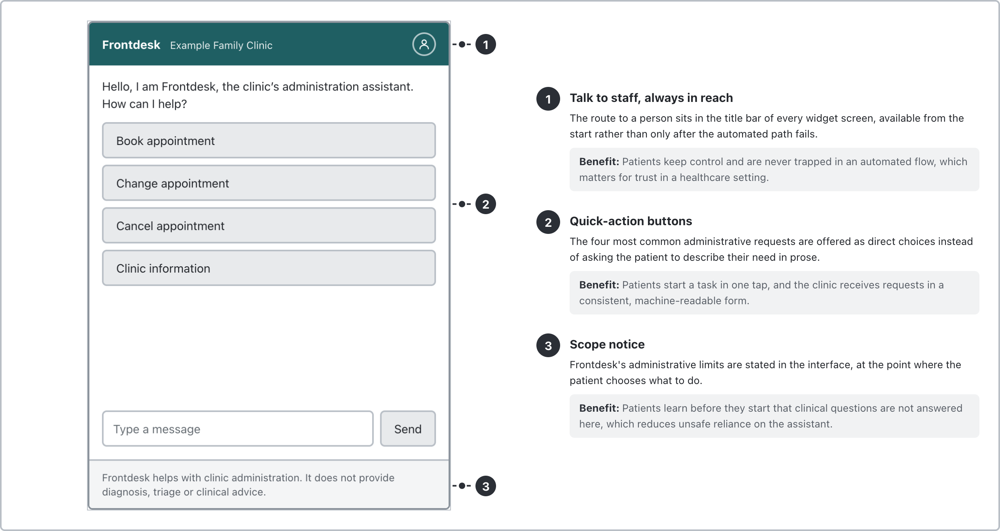
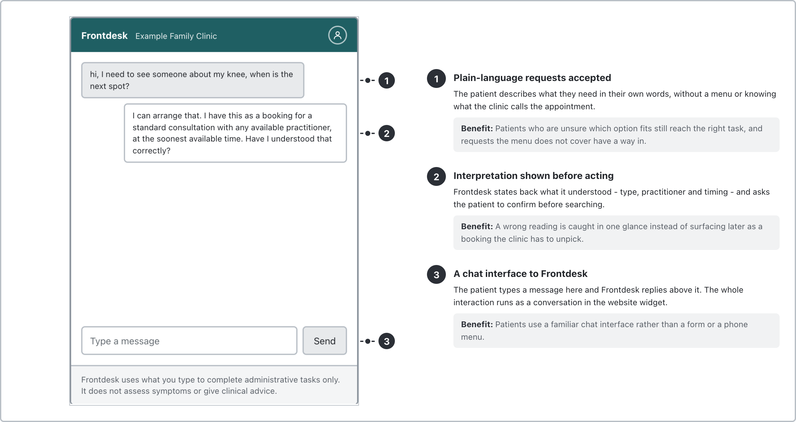
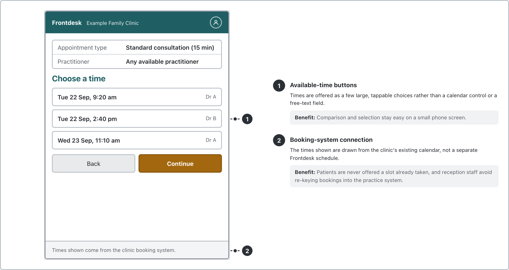
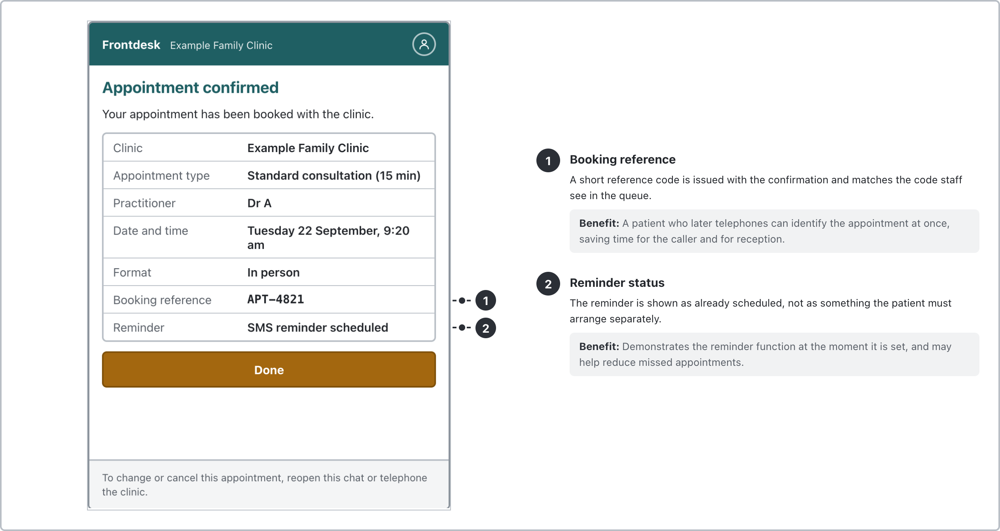
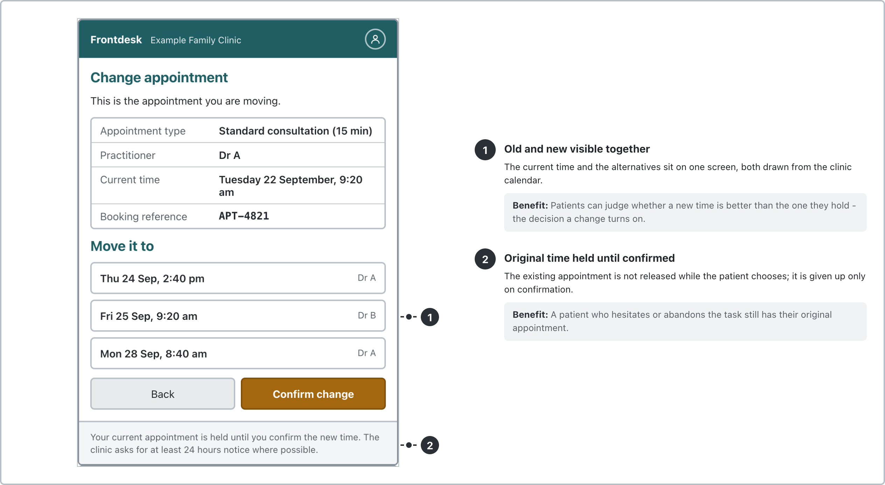
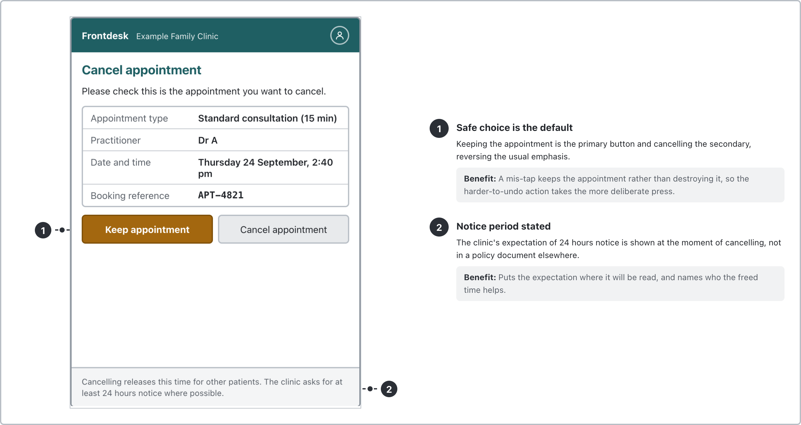
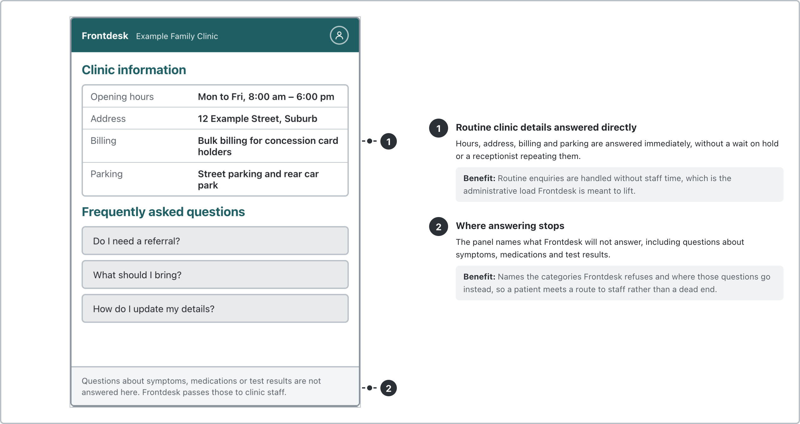
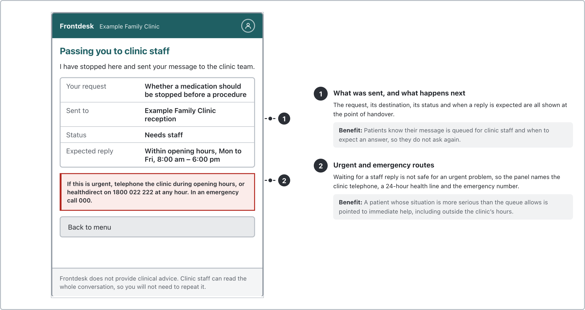

### Phone Line Call Flow:

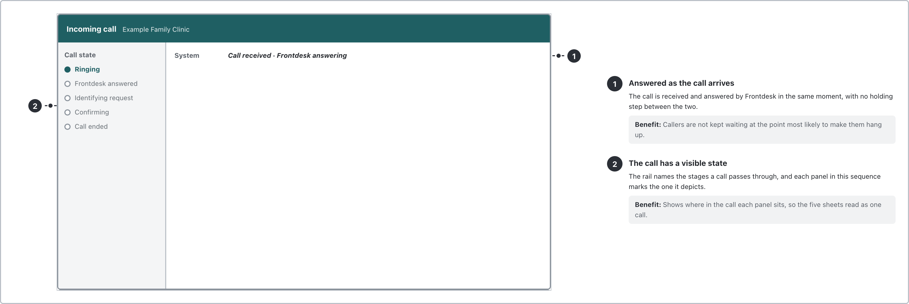
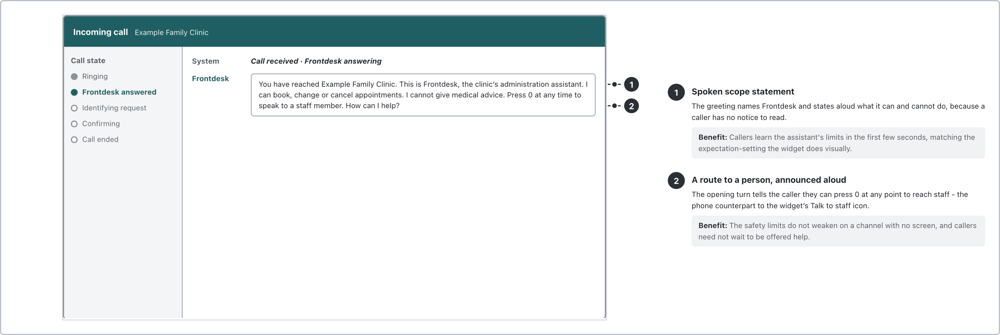
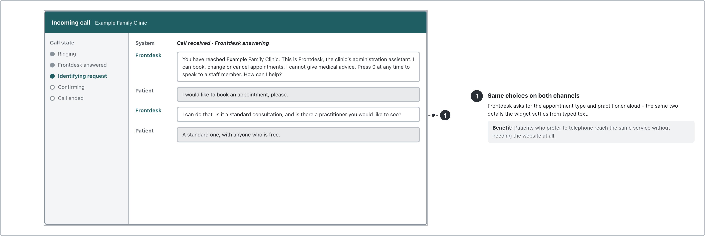
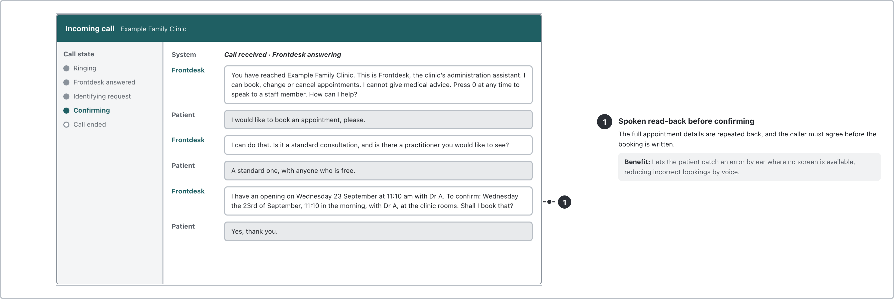
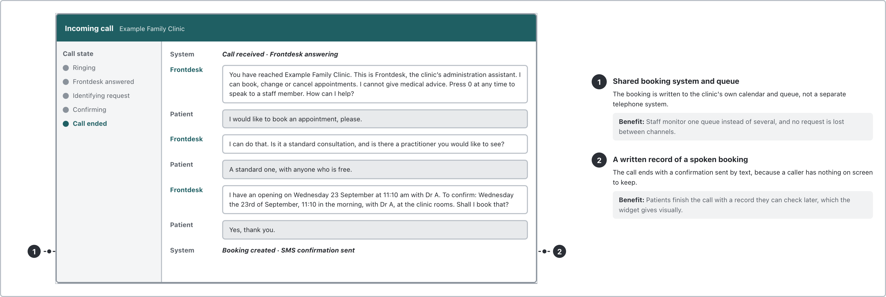

### Staff Dashboard:

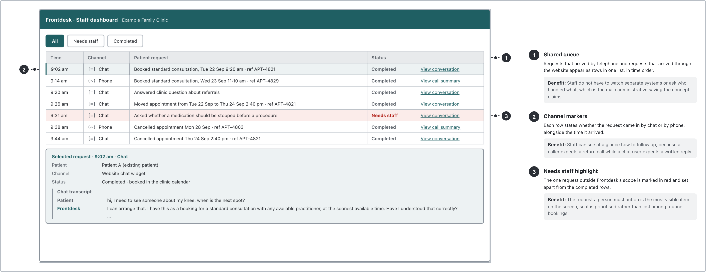
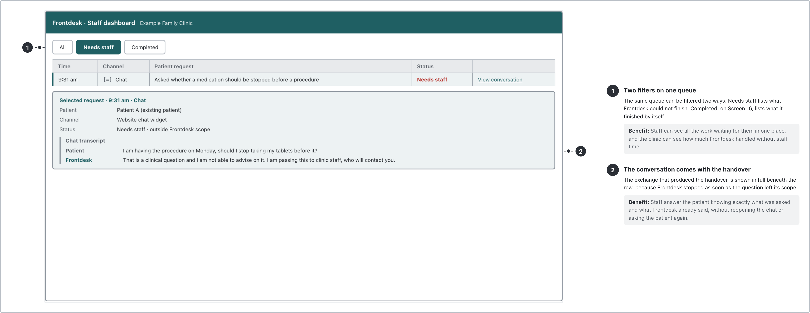
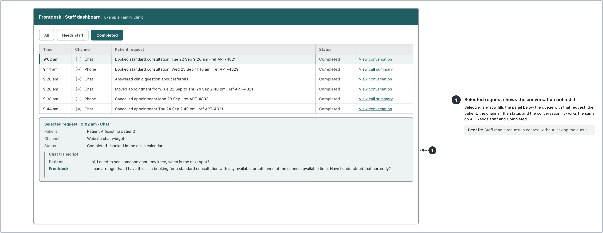
